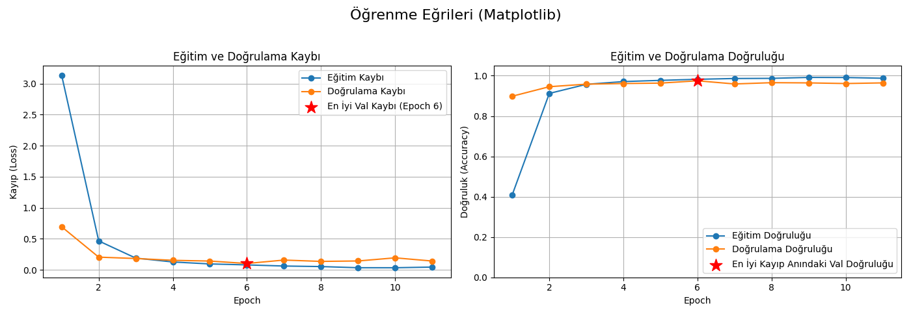
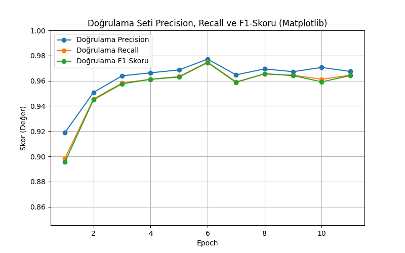

# Hayvan Sınıflandırma Uygulaması

Bu proje, Masaüstü hayvan sınıflandırma uygulamasıdır. PyTorch tabanlı bir Swin Transformer modeli kullanarak verilen görsellerdeki (tekil resim, klasördeki resimler veya webcam görüntüsü) hayvan türlerini 90 farklı sınıf için tahmin etmeyi amaçlar.

## İçindekiler

- [Genel Bakış](#genel-bakış)
- [Özellikler](#özellikler)
- [Kullanılan Teknolojiler](#kullanılan-teknolojiler)
- [Uygulamanın Çalıştırılması](#uygulamanın-çalıştırılması)
- [Model Eğitimi](#model-eğitimi)
---

## Genel Bakış

Hayvan Sınıflandırma Uygulaması, kullanıcıların resimler veya canlı webcam görüntüleri aracılığıyla hayvan türlerini hızlı ve kolay bir şekilde tanımlamasını sağlayan bir araçtır. Uygulama, eğitilmiş bir derin öğrenme modeli kullanarak tahminlerde bulunur ve sonuçları kullanıcı dostu bir arayüzde sunar.

---

## Özellikler

-   **Tekil Resimden Tahmin:** Kullanıcının seçtiği tek bir resim dosyasındaki hayvan türünü tahmin etme.
-   **Klasörden Toplu Tahmin:** Bir klasör içerisindeki tüm resimler için toplu hayvan türü tahmini yapma.
-   **Webcam ile Canlı Tahmin:** Bilgisayar kamerası aracılığıyla gerçek zamanlı hayvan türü tahmini.
-   **Tahmin Sonuçları Gösterimi:**
    -   En yüksek olasılıklı tahmin edilen hayvan türü ve güven skoru.
    -   Belirlenen en iyi K (Top-K) adet tahminin olasılıklarıyla birlikte listelenmesi.
    -   Düşük güvenli tahminler için görsel uyarı.
-   **Tahmin Geçmişi:**
    -   Yapılan tahminlerin (resim yolu, küçük resmi, tahmin sonucu, güven skoru, tarih) listelenmesi.
    -   Geçmişteki bir tahmine tıklayarak sonuçları tekrar yükleme.
    -   Geçmişteki tek bir öğeyi veya tüm geçmişi silme.
-   **Ayarlar Penceresi:**
    -   Maksimum geçmiş öğe sayısı.
    -   Gösterilecek en iyi K tahmin sayısı.
    -   Düşük güven eşiği (yüzdelik).
    -   Ayarları varsayılana sıfırlama.
-   **Online Arama:** En iyi tahmin edilen hayvan türünü Google Görseller'de hızlıca arama.
-   **Kullanıcı Dostu Arayüz:** CustomTkinter ile modern ve etkileşimli bir kullanıcı arayüzü.
-   **Model Durumu Göstergesi:** Modelin yüklenip hazır olup olmadığını belirten durum mesajları.

---

## Kullanılan Teknolojiler

-   **Model:** Swin Transformer (`swin_base_patch4_window7_224`)
-   **Framework ve Kütüphaneler:**
    -   Python
    -   PyTorch
    -   TorchVision
    -   timm
    -   OpenCV-Python 
    -   Pillow (PIL)
    -   CustomTkinter
    -   Scikit-learn
    -   Matplotlib

---

## Uygulamanın Çalıştırılması

1. Özellikle model ağırlık dosyasının (`best_checkpoint.pth`) `app.py` içinde belirtilen yolda olduğundan veya `MODEL_CHECKPOINT_PATH` değişkeninin doğru şekilde güncellendiğinden emin olun.
2. Uygulamayı başlatmak için proje ana dizinindeyken (ve sanal ortam aktifken) terminalde şu komutu çalıştırın:
    ```bash
    python app.py
    ```
4.  Uygulama arayüzü açıldığında aşağıdaki işlemleri yapabilirsiniz:
    * **🖼️ Resim Yükle:** Bilgisayarınızdan tek bir hayvan resmi seçerek tahmin işlemi için yükleyebilirsiniz.
    * **🧠 Tahmin Et:** Yüklenmiş olan resim için sınıflandırma işlemini başlatır.
    * **📁 Klasör Seç:** İçerisinde hayvan resimleri bulunan bir klasörü seçerek tüm resimler için sırayla tahmin yapılmasını sağlar.
    * **📷 Webcam Başlat/Durdur:** Bilgisayarınızın web kamerasını açarak canlı görüntü üzerinden anlık hayvan türü tahminleri yapar.
    * **⚙️ Ayarlar:** Tahmin geçmişinde tutulacak maksimum öğe sayısı, sonuçlarda gösterilecek en iyi K tahmin sayısı ve düşük güven eşiği gibi parametreleri ayarlayabilirsiniz.
    * **Tahmin Sonuçları:** Sol tarafta seçilen resim, ortada tahmin edilen en iyi tür, güven skoru ve diğer olası türler listelenir.
    * **Tahmin Geçmişi:** Sağ taraftaki panelde daha önce yapılan tahminler küçük resimleri, en iyi tahminleri ve güven skorlarıyla birlikte listelenir. Geçmişteki bir öğeye tıklayarak sonucu tekrar yükleyebilir, sağ tıklayarak silebilir veya dosya konumunu açabilirsiniz. "Tüm Geçmişi Temizle" butonu ile tüm geçmiş silinebilir.
    * **🔍 Online Arama:** Tahmin sonucu bölümündeki büyüteç ikonuna tıklayarak, en yüksek olasılıkla tahmin edilen hayvan türünü Google Görseller'de hızlıca aratabilirsiniz.

---

## Model Eğitimi

Model, proje içerisinde bulunan `EgitimKodu.py` adlı Jupyter Notebook kullanılarak eğitilmiştir. Eğitim süreci aşağıdaki ana adımları ve kritik parametreleri içermektedir:

1.  **Ortam ve Veri Seti:**
    * Eğitim, Google Colab ortamında GPU kullanılarak gerçekleştirilmiştir.
    * Veri seti olarak 90 farklı hayvan sınıfını içeren `MultiZoo_Dataset` kullanılmıştır. Bu veri setinin Google Drive üzerinde (`/content/drive/MyDrive/Yazlab3/MultiZoo_Dataset/train`) bulunduğu varsayılmıştır.
    * Veri seti, PyTorch'un `datasets.ImageFolder` yapısı ile yüklenmiş ve %20'si doğrulama (validation) seti olarak ayrılmıştır.

2.  **Veri Ön İşleme ve Artırma (Data Augmentation):**
    * Tüm resimler `224x224` piksel boyutuna getirilmiştir.
    * **Eğitim verisi için uygulanan transformasyonlar:** `RandomResizedCrop`, `RandomHorizontalFlip`, `TrivialAugmentWide` (çeşitli artırma tekniklerini otomatik uygular), `ToTensor` ve standart ImageNet `MEAN` ([0.485, 0.456, 0.406]) ve `STD` ([0.229, 0.224, 0.225]) değerleri ile normalizasyon.
    * **Doğrulama verisi için uygulanan transformasyonlar:** `Resize`, `CenterCrop`, `ToTensor` ve aynı `MEAN`/`STD` değerleri ile normalizasyon.
    * Veri yükleyiciler (`DataLoader`), eğitim için `BATCH_SIZE = 32` ile ve karıştırılarak (shuffle=True), doğrulama için ise karıştırılmadan oluşturulmuştur.

3.  **Model Mimarisi ve Yapılandırması:**
    * Model olarak `timm` kütüphanesinden ImageNet üzerinde ön-eğitilmiş (pretrained=True) `swin_base_patch4_window7_224` mimarisi kullanılmıştır.
    * Modelin son katmanı, veri setindeki 90 sınıfa uygun olarak değiştirilmiştir (`num_classes=90`).
    * Eğitim CUDA (GPU) üzerinde yapılmıştır.

4.  **Eğitim Parametreleri:**
    * **Kayıp Fonksiyonu:** `nn.CrossEntropyLoss`.
    * **Optimizleyici:** `optim.AdamW` (Öğrenme Oranı: `3e-5`, Ağırlık Azaltma (Weight Decay): `0.05`).
    * **Öğrenme Oranı Zamanlayıcısı:** `CosineAnnealingLR` (Maksimum epoch sayısı `EPOCHS=50`'ye göre kosinüs eğrisiyle öğrenme oranını düşürür, minimum öğrenme oranı `LEARNING_RATE / 100` olarak ayarlanmıştır).
    * **Karma Hassasiyet (AMP - Automatic Mixed Precision):** Eğitim hızını artırmak ve bellek kullanımını azaltmak için `torch.cuda.amp.GradScaler` ve `autocast` kullanılmıştır.
    * **Gradyan Kırpma (Gradient Clipping):** Gradyanların patlamasını önlemek için `max_norm=1.0` ile gradyan kırpma uygulanmıştır.

5.  **Eğitim Döngüsü ve Değerlendirme:**
    * Model, maksimum `EPOCHS = 50` epoch boyunca eğitilmiştir.
    * Her epoch sonunda doğrulama seti üzerinde modelin performansı; kayıp, doğruluk (accuracy), kesinlik (precision), duyarlılık (recall) ve F1 skoru metrikleri ile değerlendirilmiştir.
    * **Early Stopping:** Doğrulama kaybında (`val_loss`) `EARLY_STOPPING_PATIENCE = 5` epoch boyunca `EARLY_STOPPING_MIN_DELTA = 0.001`'den daha iyi bir iyileşme olmazsa eğitim erken durdurulmuştur.
    * **Checkpointing:** En iyi doğrulama kaybını veren model ağırlıkları (`best_checkpoint.pth`) ve her epoch sonundaki son model ağırlıkları (`latest_checkpoint.pth`) kaydedilmiştir.

6.  **Eğitim Sonuçları ve Grafikler:**
    * Eğitim tamamlandıktan sonra, en iyi modelin doğrulama seti üzerindeki nihai performansı raporlanmıştır.
    * Eğitim ve doğrulama sürecindeki kayıp ve doğruluk değerleri ile doğrulama setindeki precision, recall ve F1-skoru değerlerinin epoch'lara göre değişimi `matplotlib` kullanılarak aşağıdaki gibi grafiklerle görselleştirilmiştir:

    **Öğrenme Eğrileri (Loss ve Accuracy):**
    
    *Grafik: Eğitim ve Doğrulama Kaybı (Sol), Eğitim ve Doğrulama Doğruluğu (Sağ)*

    **Doğrulama Seti Metrikleri (Precision, Recall, F1-Skoru):**
    
    *Grafik: Doğrulama Seti Precision, Recall ve F1-Skoru Değişimi*

Bu adımlar sonucunda elde edilen `best_checkpoint.pth` model ağırlık dosyası, `app.py` masaüstü uygulamasında hayvan sınıflandırma tahminleri yapmak için kullanılır. Dosya adını `best_checkpoint.pth` olarak değiştirip `app.py`'nin beklediği konuma yerleştirmek veya `app.py` içerisindeki yolu güncellemek gerekebilir.

---

